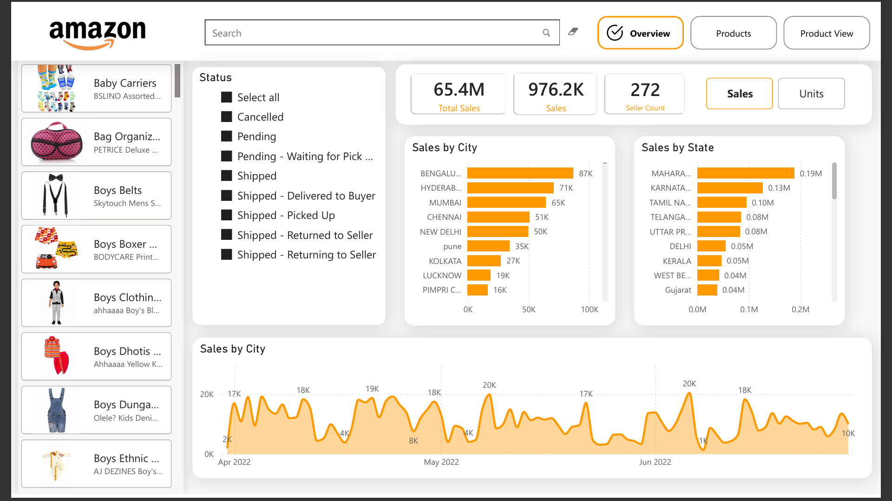
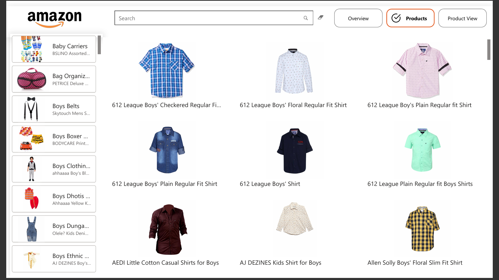
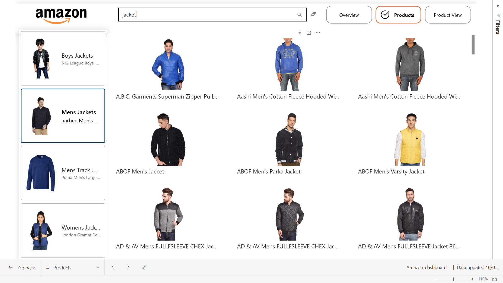
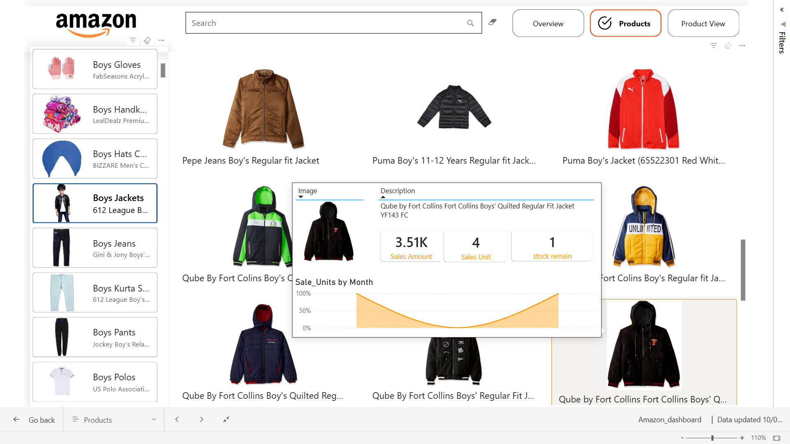

# Amazon Sales Analytics Dashboard

## Overview

An interactive Power BI dashboard built to analyze Amazon sales performance, product trends, and inventory insights. The dashboard includes a searchable product catalog, custom hover tooltips, drill-through product pages, and interactive visualizations for sales analysis across different locations and product categories.

---

## Features

- KPI Monitoring (Total Sales, Sales Units, Seller Count)
- Product-Level Analysis
- Interactive Search Bar for Product Discovery
- Custom Hover Tooltips
- Drill-through Product View
- Dynamic Filtering by Order Status
- Product Image Integration
- Navigation Buttons Between Pages
- Sales Analysis by City and State
- Sales Trend Visualization

---

## Tools & Technologies

- Power BI
- DAX
- Power Query
- Data Cleaning
- Data Visualization

---

## Dashboard Screenshots

### Overview Dashboard



### Products Dashboard



### Product View Dashboard


### Search Functionality



### Custom Tooltip



---

## Repository Structure

```text
Amazon_insight_dashboard
│
├── Dashboard
│   └── Amazon_dashboard.pbix
│
├── Dataset
│   ├── Amazon Fashion XL.zip
│   └── Amazon Sale Report.xlsx
│
├── Screenshots
│   ├── Overview.png
│   ├── Products.png
│   ├── Product view.png
│   ├── Searchbar.png
│   └── Tooltip.png
│
└── README.md
```

---

## Key Insights Delivered

- Sales performance tracking through KPI cards
- Product-wise sales analysis
- State-wise and city-wise sales comparison
- Order status monitoring
- Interactive product exploration using search functionality
- Detailed product insights through drill-through pages
- Enhanced user experience with custom tooltips and navigation

---

## Author

**Nikhil Singh Mahar**

GitHub: `https://github.com/maharnikhil`

---

## Project Status

-- Completed --
